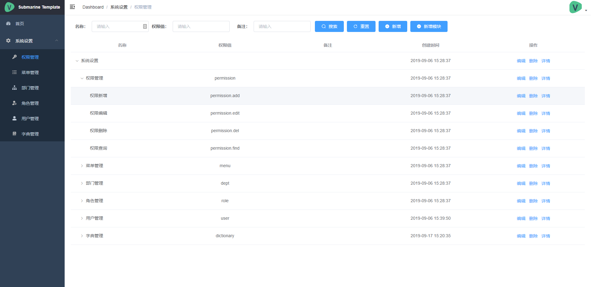
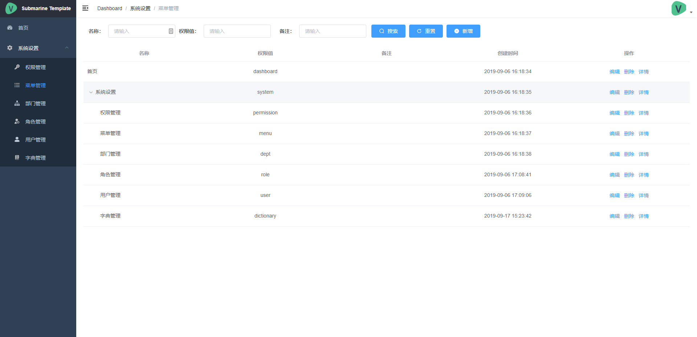
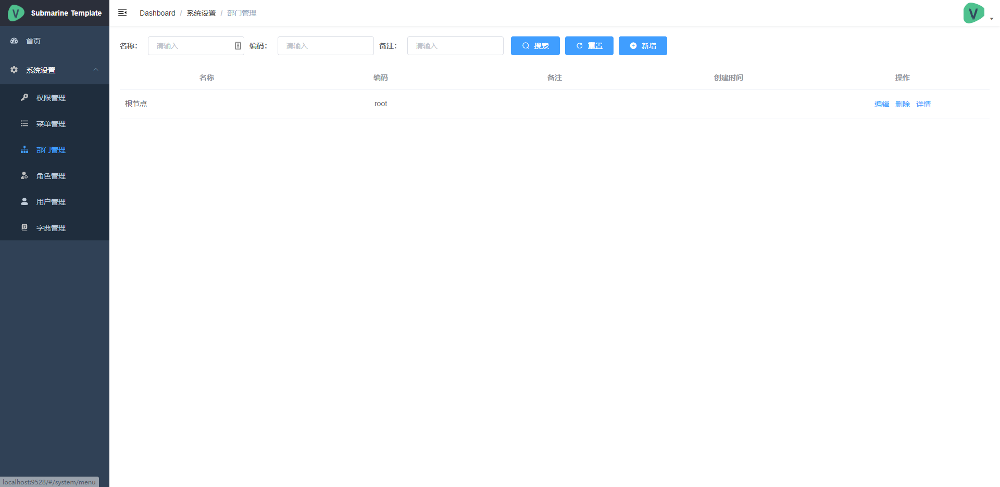
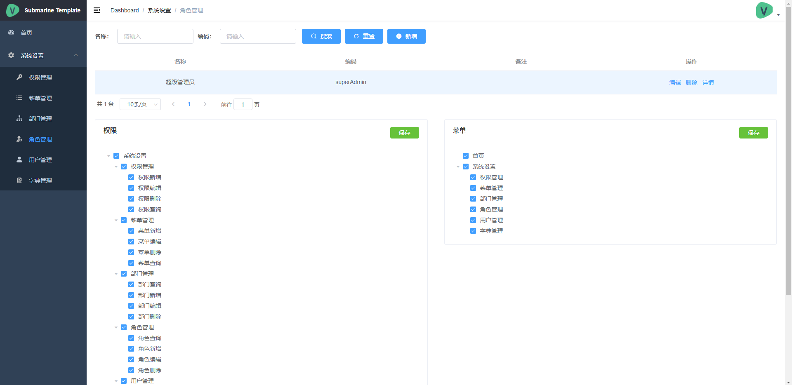
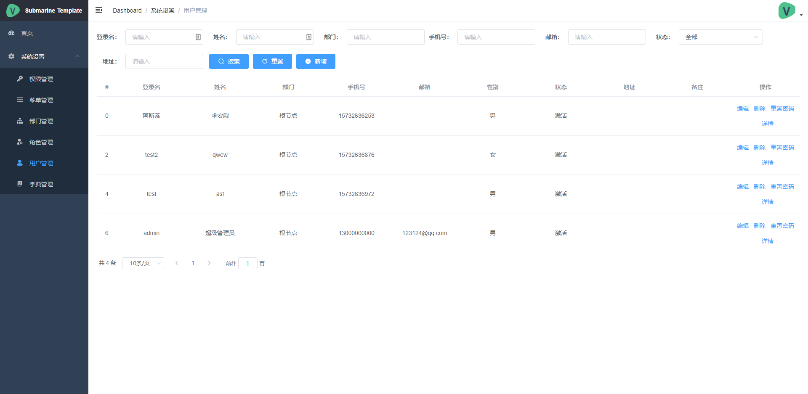
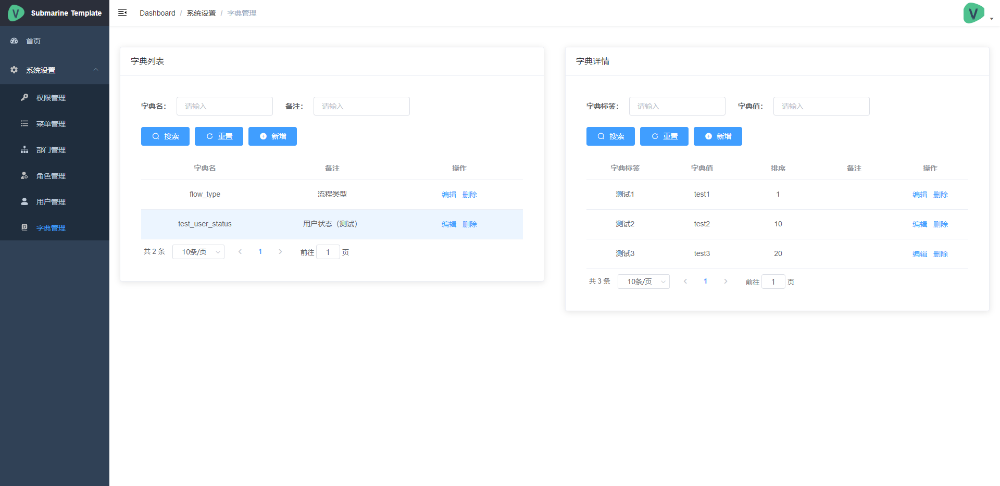
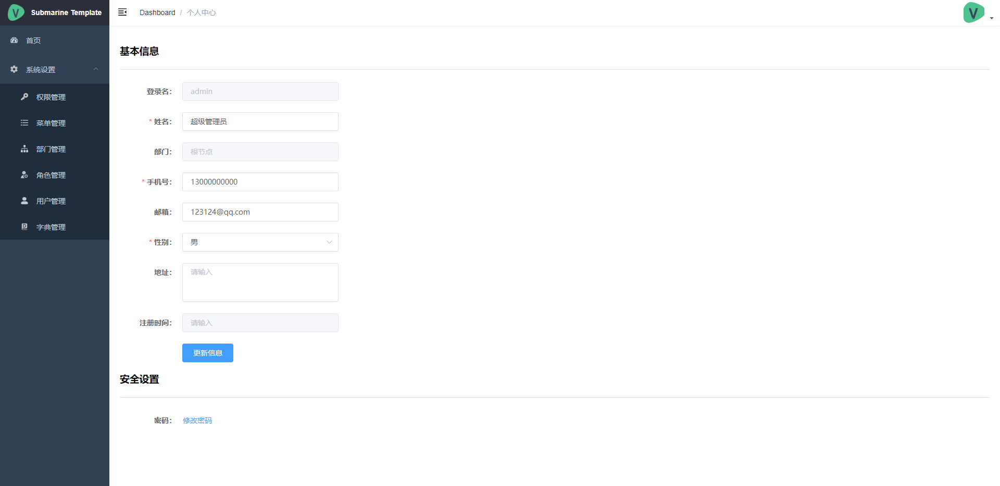

# submarine 后台管理系统

## 项目简介

submarine 是一个前后端分离的后台管理系统

致力于使用最流行最主流的前后端技术，对于各种使用场景都有相应的解决方案，对需求的变化充满信心。

## 技术选型

1. 后端

    - springboot 2.1.7
    - mybatis
    - mybatis-plus
    - spring security
    - jwt
    - mapstruct
    - lombok

2. 前端

    - Vue
    - Element UI
    - axios
    - vue-admin-template
    - Webpack

## 系统功能

- 用户管理
- 角色管理
- 权限管理
- 机构管理
- 菜单管理

## 前端预览
<table>
    <tr>
        <td></td>
        <td></td>
    </tr>
    <tr>
        <td></td>
        <td></td>
    </tr>
    <tr>
        <td></td>
        <td></td>
    </tr>
    <tr>   
        <td></td>
    </tr>
</table>

## 使用说明

说明 [wiki](https://github.com/GoldSubmarine/submarine-admin-backend/wiki)